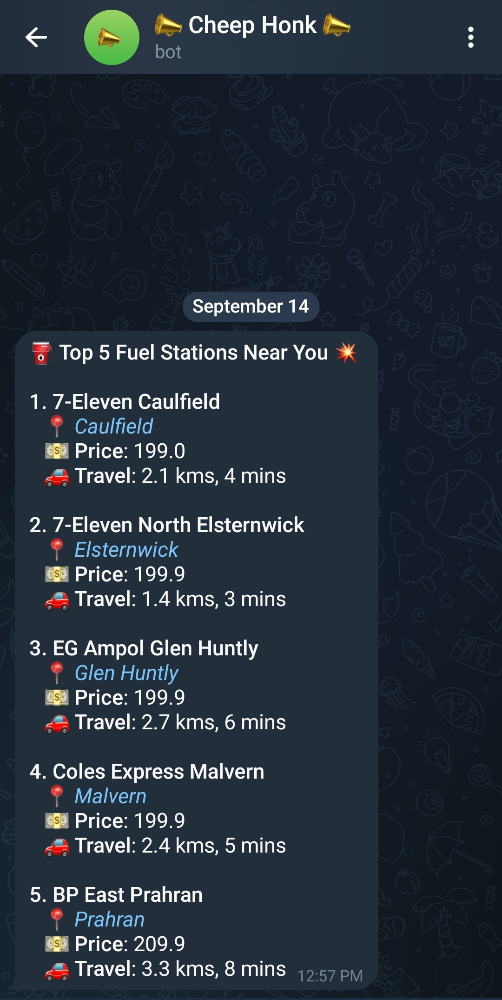
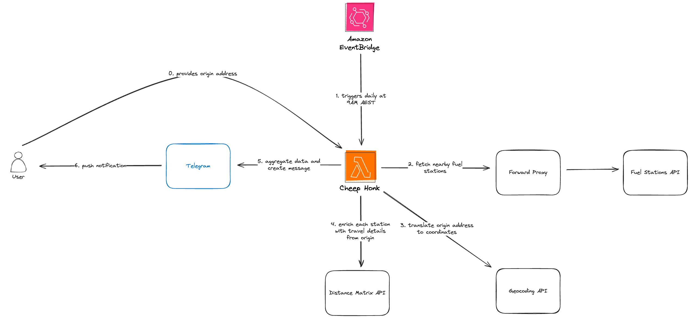

# 📣 Cheep Honk 📣

<i>Telegram Notification</i>

As the cost of fuel prices have sky rocketed, I needed a way to reliably gauge the lowest prices near me to save a few bucks. Daily notifications are sent to my phone, which allows me to stay on top of fuel prices.

## Technology 🛠️

- [Kotlin](https://kotlinlang.org/)
- [Gradle](https://gradle.org/)
- [GitHub Actions](https://github.com/features/actions)
- [AWS Lambda](https://aws.amazon.com/lambda/features/)
- [AWS EventBridge](https://aws.amazon.com/eventbridge/features/)

## External Services 🛎️
- [Telegram Bot API](https://core.telegram.org/bots/api)
- [Google Distance Matrix API](https://developers.google.com/maps/documentation/distance-matrix/overview)
- [Google Geocoding API](https://developers.google.com/maps/documentation/geocoding/overview)
- [PetrolSpy API](https://petrolspy.com.au/)
- [ScrapingBee Proxy](https://www.scrapingbee.com/)

## Architecture 🏛️

## Testing 🧪
[JUnit](https://junit.org/junit5/) and [Mockk](https://mockk.io/) were used to write unit tests. Tests follow a simple hierarchy where each test is named `[ClassToTest]Test.kt` with nested inner classes dedicated to a single method for that class.

## CI/CD Pipeline ⏩
[CI/CD pipeline](https://github.com/nixonsu/cheep-honk/actions/workflows/pipeline.yaml) is used to automate tests, package and deploy to production when pushed to `main`.

## Future considerations
This service was built with the intention of only being used by a single user. The user also needs developer expertise in order to get the service up and running. 

To scale and support multiple users, one can explore implementing simpler interface. Telegram can be further explored to allow individual users to sign up for the service using [webhooks](https://core.telegram.org/bots/webhooks) and customise profile settings.
